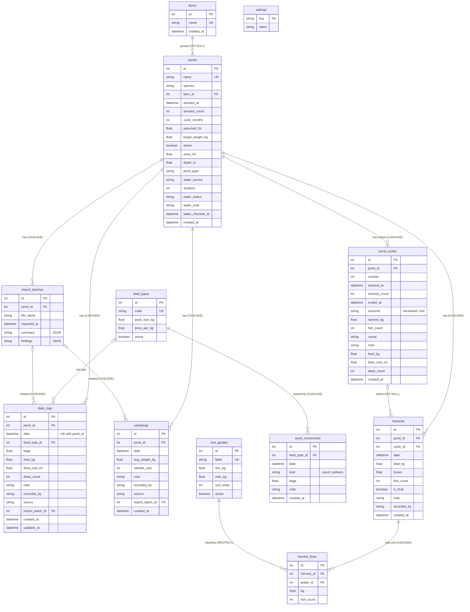

# Database schema

Generated from `prisma/schema.prisma`.

```mermaid
erDiagram
    farms ||--o{ ponds : "groups (SET NULL)"
    ponds ||--o{ pond_cycles : "has history (CASCADE)"
    ponds ||--o{ daily_logs : "has (CASCADE)"
    ponds ||--o{ samplings : "has (CASCADE)"
    ponds ||--o{ import_batches : "has (CASCADE)"
    ponds ||--o{ harvests : "has (CASCADE)"
    pond_cycles |o--o{ harvests : "closes (SET NULL)"
    feed_types |o--o{ daily_logs : "fed with"
    feed_types ||--o{ stock_movements : "tracked by (CASCADE)"
    import_batches |o--o{ daily_logs : "created (CASCADE)"
    import_batches |o--o{ samplings : "created (CASCADE)"
    harvests ||--o{ harvest_lines : "split into (CASCADE)"
    size_grades ||--o{ harvest_lines : "classifies (RESTRICT)"

    farms {
        int id PK
        string name UK
        datetime created_at
    }

    ponds {
        int id PK
        string name UK
        string species
        int farm_id FK
        datetime stocked_at
        int stocked_count
        int cycle_months
        float assumed_fcr
        float target_weight_kg
        boolean active
        float area_m2
        float depth_m
        string pond_type
        string water_source
        int aerators
        string water_status
        string water_note
        datetime water_checked_at
        datetime created_at
    }

    pond_cycles {
        int id PK
        int pond_id FK
        int number
        datetime stocked_at
        int stocked_count
        datetime ended_at
        string outcome "harvested | lost"
        float harvest_kg
        int fish_count
        string cause
        string note
        float feed_kg
        float feed_cost_rm
        int dead_count
        datetime created_at
    }

    feed_types {
        int id PK
        string code UK
        float pack_size_kg
        float price_per_kg
        boolean active
    }

    daily_logs {
        int id PK
        int pond_id FK
        datetime date "UK with pond_id"
        int feed_type_id FK
        float bags
        float feed_kg
        float feed_cost_rm
        int dead_count
        string note
        string recorded_by
        string source
        int import_batch_id FK
        datetime created_at
        datetime updated_at
    }

    samplings {
        int id PK
        int pond_id FK
        datetime date
        float avg_weight_kg
        int sample_size
        string note
        string recorded_by
        string source
        int import_batch_id FK
        datetime created_at
    }

    stock_movements {
        int id PK
        int feed_type_id FK
        datetime date
        string kind "count | delivery"
        float bags
        string note
        datetime created_at
    }

    import_batches {
        int id PK
        int pond_id FK
        string file_name
        datetime imported_at
        string summary "JSON"
        string findings "JSON"
    }

    harvests {
        int id PK
        int pond_id FK
        int cycle_id FK
        datetime date
        float total_kg
        float boxes
        int fish_count
        boolean is_final
        string note
        string recorded_by
        datetime created_at
    }

    harvest_lines {
        int id PK
        int harvest_id FK
        int grade_id FK
        float kg
        int fish_count
    }

    size_grades {
        int id PK
        string label UK
        float min_kg
        float max_kg
        int sort_order
        boolean active
    }

    settings {
        string key PK
        string value
    }
```
